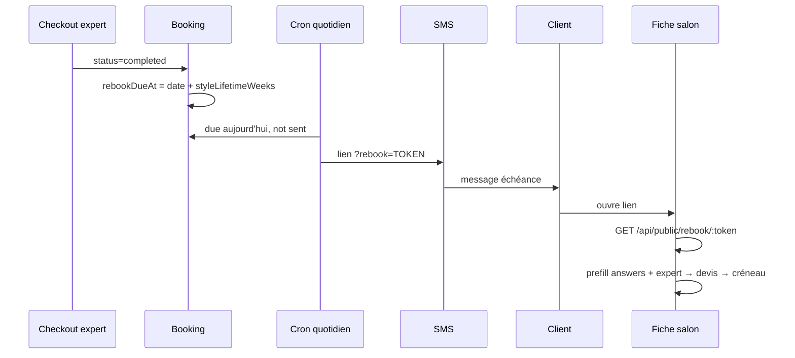

# Rebooking automatique — implémentation Skedisy (StyleSeat × Afro)

## Idée produit

Les protective styles ont une **durée de vie** (ex. Knotless 6–8 semaines).  
À échéance, Skedisy relance la cliente :

> Votre Knotless arrive à échéance  
> Votre dernière Knotless date d'il y a 7 semaines.  
> Souhaitez-vous reprendre la même prestation ?  
> **[Réserver ma dernière coiffure]**

Prérempli : même coiffeuse · même config (longueur, couleur…) · **nouveau créneau**.

Canon plan : `STYLESEAT_LEARNINGS_PLAN.md` §9 · `IMPLEMENTATION_PLAN_SQUIRE.md` (`styleLifetimeWeeks`).

---

## Architecture L1 (MVP)

### Données

| Champ | Où | Rôle |
|---|---|---|
| `afroConfig.styleLifetimeWeeks` | Salon → service | Durée de vie (défaut 7 si afro S2+) |
| `afroConfig.rebookRemindersEnabled` | Salon → service | Opt-in relance (défaut true si lifetime > 0) |
| `Booking.clientAnswers` | Booking | Snapshot réponses cliente (pas le moteur) |
| `Booking.rebookDueAt` | Booking | Date d’échéance calculée au checkout |
| `Booking.rebookToken` | Booking | Token opaque pour le deep-link |
| `Booking.rebookReminderSent` | Booking | Anti-doublon SMS |

### Flux

1. **Checkout** (`bookingForExpert` → `completed`) → `scheduleRebookOnComplete(booking)`
2. **Cron 09:00 Europe/Paris** → `processDueRebookReminders()`
3. **SMS** + lien `https://skedisy.com/salon/{slug}?rebook={token}`
4. **Web** charge le contexte, préremplit `afroAnswers` + `expertId`, ouvre le tunnel

### Hors L1

Beauty Profile multi-salon · push FCM app · email · ML lifetime · packs entretien.

---

## L2 (plus tard)

- In-app « Reprendre ma dernière config » sans SMS
- Beauty Profile persisté
- Suppression auto si déjà un RDV futur même presta
- Relance J-7 + J+0

---

## Fichiers touchés (L1)

- `models/booking.model.js`
- `services/rebooking.service.js` (nouveau)
- `services/sms.service.js`
- `services/afroQuote.service.js` (seed `styleLifetimeWeeks: 7`)
- `controller/user/bookingForExpert.controller.js`
- `controller/user/booking.cotroller.js` (`clientAnswers`)
- `controller/user/publicRebook.controller.js` (nouveau)
- `controller/salon/afroDemand.controller.js` (patch lifetime)
- `index.js` (cron + route)
- `salonportal/.../salon-booking.js`
- Panel `Demand.js` (colonne semaines)
